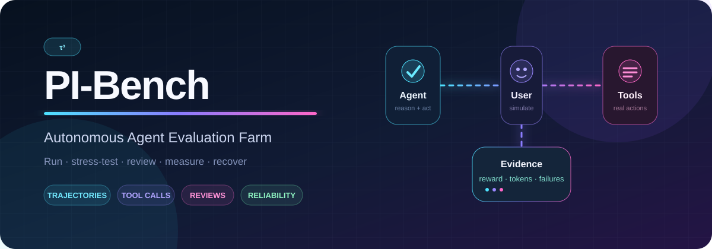
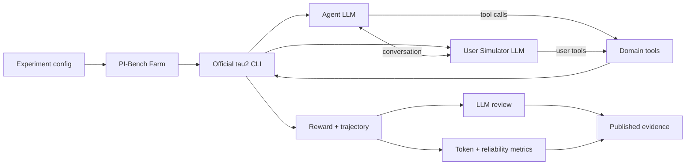

<div align="center">
  

  <br />

  [](https://github.com/sierra-research/tau2-bench)
  [](https://www.python.org/)
  [](https://docs.astral.sh/uv/)
  [](experiments/smoke/local_mock_result.json)

  **Run, stress-test, and understand real-world Agent ↔ User ↔ Tool interactions.**

  [Quick Start](#-quick-start) · [How It Works](#-how-it-works) · [Run the Farm](#-run-the-farm) · [Results](#-current-evidence) · [Roadmap](#-roadmap)
</div>

---

## ✦ Why PI-Bench?

A benchmark run is more than one score. It is a living system of conversations, tool decisions, failures, retries, reviews, and resource usage.

**PI-Bench turns τ³-bench into an evaluation farm:** a thin operational layer that keeps simulations moving and turns raw runs into auditable evidence.

<table>
<tr>
<td width="25%" align="center"><b>🎭 Simulate</b><br/><sub>Multi-turn Agent/User conversations</sub></td>
<td width="25%" align="center"><b>🛠️ Act</b><br/><sub>Real domain tool calls and state changes</sub></td>
<td width="25%" align="center"><b>🔬 Inspect</b><br/><sub>Rewards, trajectories, reviews, failures</sub></td>
<td width="25%" align="center"><b>♻️ Recover</b><br/><sub>Resume, retry, backoff, long-running farms</sub></td>
</tr>
</table>

> [!IMPORTANT]
> PI-Bench **does not reimplement τ³-bench**. The official `tau2` CLI remains the benchmark engine; this repository provides orchestration, reliability, accounting, and compact result publication.

## ◈ How It Works



| Layer | Responsibility | Reuses |
|---|---|---|
| **Runner** | Experiment IDs, subprocess isolation, configuration | `tau2 run` |
| **Farm** | Domain queue, retries, backoff, continuous execution | Official task sets |
| **Evidence** | Reward, steps, tool calls, real provider usage | τ³ result schema |
| **Review** | Agent/user error classification | `tau2 review` / `--auto-review` |
| **Explorer** | Interactive trajectory inspection | `tau2 view` |

### Supported evaluation worlds

| 🛍️ Retail | ✈️ Airline | 📡 Telecom | 🏦 Banking Knowledge | 🧪 Mock |
|:---:|:---:|:---:|:---:|:---:|
| Orders & returns | Flights & reservations | Device troubleshooting | Retrieval-grounded support | Fast plumbing checks |

## ⚡ Quick Start

**Prerequisites:** Git and [uv](https://docs.astral.sh/uv/). A system Python is optional—uv installs isolated Python 3.12 automatically.

```bash
# 1 · Get PI-Bench
git clone https://github.com/lavine888/pi-bench.git
cd pi-bench

# 2 · Clone and install the pinned-compatible τ³ core
./scripts/bootstrap.sh
# Windows PowerShell: .\scripts\bootstrap.ps1

# 3 · Validate everything without credentials
cd _external/tau2-bench
PYTHONUTF8=1 uv run python ../../scripts/local_mock_smoke.py
```

Expected signal:

```text
mock/create_task_1  →  create_task(...)  →  reward 1.0  ✓
```

<details>
<summary><b>What does the credential-free smoke actually test?</b></summary>

It drives a deterministic scripted agent through the **real** τ³ half-duplex orchestrator, mock environment, tool executor, trajectory model, and environment grader. It validates the pipeline without pretending to be an LLM result.

- ✅ Real τ³ orchestration
- ✅ Real `create_task` tool call and state mutation
- ✅ Readable trajectory
- ✅ Reward calculation
- ❌ No Agent/User LLM quality measurement
- ❌ No token usage

</details>

## 🔑 Connect a Model API

PI-Bench supports OpenAI-compatible endpoints through LiteLLM. Copy `.env.example` to `.env`:

```dotenv
OPENAI_API_KEY=your-local-secret
OPENAI_BASE_URL=https://provider.example/v1
AGENT_MODEL=openai/provider-model-name
USER_MODEL=openai/provider-model-name
REVIEW_MODEL=openai/provider-model-name
```

> [!CAUTION]
> `.env` is ignored by Git. Keys are never required in source, experiment configs, or committed logs. Do not paste credentials into issues or benchmark artifacts.

The `openai/` model prefix selects LiteLLM's OpenAI-compatible adapter. Agent, user, and reviewer can use different models.

## 🧪 Run One Real Experiment

```bash
python -m runner.run_experiment --config configs/smoke.yaml
```

The default smoke is intentionally conservative:

| Domain | Tasks | Trials | Concurrency | Max steps | Resume | Verbose logs |
|---|---:|---:|---:|---:|:---:|:---:|
| retail | 5 | 1 | 1 | 100 | ✅ | ✅ |

Raw results stay local at:

```text
_external/tau2-bench/data/simulations/<experiment_id>/results.json
```

## 🌾 Run the Farm

### Multi-domain batch

```bash
python -m runner.run_farm \
  --domains retail airline telecom \
  --tasks 20 \
  --trials 3 \
  --concurrency 4 \
  --auto-review
```

### Continuous 24-hour mode

```bash
python -m runner.run_farm \
  --duration 24h \
  --continuous \
  --domains retail airline telecom \
  --tasks 50 \
  --trials 3 \
  --concurrency 8 \
  --auto-review
```

```text
PENDING → RUNNING → COMPLETED
              └──→ RETRYING ──→ COMPLETED
                       └───────→ FAILED
```

Each batch receives a unique experiment ID. A failed subprocess is isolated and retried with exponential backoff; completed work can resume through upstream `--auto-resume`.

> [!TIP]
> Ramp concurrency progressively: **1 → 2 → 4 → 8**. Respect provider RPM/TPM limits and step down when 429s or provider errors rise.

## 📊 Current Evidence

<div align="center">

| Pipeline | Reward | Tool calls | Trajectory | Upstream checks |
|:---|---:|---:|---:|---:|
| Credential-free `mock/create_task_1` | **1.0** | **1** | **3 messages** | **23 passed** |

</div>

The result is intentionally labeled **plumbing validation**, not a model leaderboard score. No external API or paid tokens were used.

**Inspect the evidence:**

- [`experiments/smoke/local_mock_result.json`](experiments/smoke/local_mock_result.json) — representative trajectory
- [`docs/RESULTS.md`](docs/RESULTS.md) — result narrative
- [`results/latest.json`](results/latest.json) — latest model-backed aggregate metrics
- [`results/leaderboard.csv`](results/leaderboard.csv) — experiment table
- [`results/upstream-version.json`](results/upstream-version.json) — exact τ³ revision

## 🪙 Token Accounting

PI-Bench records **provider-reported usage**, never estimates disguised as ground truth.

```json
{
  "role": "agent",
  "input_tokens": 1240,
  "output_tokens": 186,
  "total_tokens": 1426,
  "cached_tokens": 800,
  "reasoning_tokens": null,
  "latency_ms": 2310
}
```

The accounting pipeline normalizes available input, output, cached, reasoning, latency, role, task, and trial fields into local `results/token-usage.jsonl`, then updates:

```text
provider usage ──→ per-call ledger ──→ experiment totals ──→ leaderboard
```

If a provider omits usage, PI-Bench leaves it unknown rather than fabricating a value.

## 🔭 Observe a Run

```bash
# Compact farm metrics
python -m runner.status

# Official interactive trajectory viewer
cd _external/tau2-bench
uv run tau2 view
```

Useful operational files:

| Path | Purpose | Git policy |
|---|---|---|
| `logs/<experiment>.log` | Local subprocess diagnostics | ignored |
| `logs/failures.jsonl` | Retry/failure ledger | ignored |
| `results/latest.json` | Compact current metrics | committed |
| `results/leaderboard.csv` | Aggregated experiment history | committed |
| `experiments/` | Metadata and selected small samples | committed |
| `_external/` | Upstream source and raw trajectories | ignored |

## 🛡️ Reliability by Design

- **Crash isolation** — one τ³ subprocess failure does not stop the farm
- **Bounded retries** — exponential backoff instead of hot-looping
- **Resume support** — rerun the same experiment ID safely
- **Credential hygiene** — no API keys in source or published logs
- **Artifact discipline** — summaries and samples in Git; multi-GB raw outputs stay local
- **Version evidence** — exact upstream SHA accompanies every comparable run

Planned fault-injection campaigns will measure recovery from process kills, API timeouts, tool failures, conversation interruptions, worker restarts, and interrupted result writes.

## 🗺️ Roadmap

| Stage | Capability | Status |
|---:|---|:---:|
| 0 | Environment + native τ³ CLI | ✅ |
| 1 | Credential-free mock tool trajectory | ✅ |
| 2 | Real retail Agent/User smoke | 🔐 API required |
| 3 | Provider token accounting | 🧰 ready for real run |
| 4 | Retail → Airline → Telecom farm | 🧰 runner ready |
| 5 | Automated conversation review | 🧰 wiring ready |
| 6 | Live dashboard | ⏳ planned |
| 7 | Fault injection + recovery metrics | ⏳ planned |

## 🗂️ Repository Map

```text
pi-bench/
├── runner/          # orchestration, farm, retries, status, aggregation
├── configs/         # reproducible experiment definitions
├── experiments/     # metadata and selected compact evidence
├── results/         # latest metrics, leaderboard, upstream version
├── scripts/         # Windows + Unix bootstrap/run commands
├── docs/            # environment, plan, results, troubleshooting
└── _external/       # local upstream clone + raw runs (gitignored)
```

<details>
<summary><b>Common commands</b></summary>

```bash
# Bootstrap
./scripts/bootstrap.sh

# Credential-free integration smoke
cd _external/tau2-bench && PYTHONUTF8=1 uv run python ../../scripts/local_mock_smoke.py

# Real retail smoke
python -m runner.run_experiment --config configs/smoke.yaml

# Farm status
python -m runner.status

# Native τ³ commands
cd _external/tau2-bench
uv run tau2 intro
uv run tau2 check-data
uv run tau2 view
```

</details>

## 🤝 Upstream & Attribution

PI-Bench builds on **[sierra-research/tau2-bench](https://github.com/sierra-research/tau2-bench)**, currently τ³-bench. Upstream is cloned during bootstrap instead of being vendored here.

- Exact tested revision: [`results/upstream-version.json`](results/upstream-version.json)
- Integration notes: [`upstream/README.md`](upstream/README.md)
- Upstream documentation and licensing remain with the upstream authors

> **Build the evidence, not another benchmark engine.**

---

<div align="center">
  <sub>PI-Bench · Agent trajectories into measurable reliability</sub>
</div>
