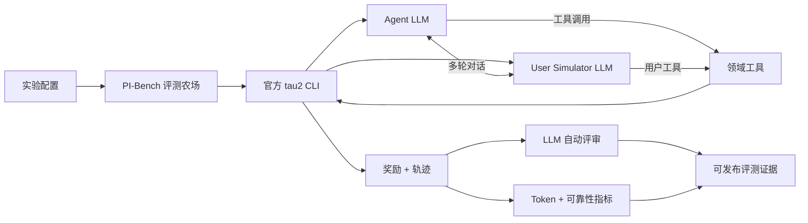

<div align="center">
  <p><a href="README.md">English</a> · <b>简体中文</b></p>

  

  <br />

  [](https://github.com/sierra-research/tau2-bench)
  [](https://www.python.org/)
  [](https://docs.astral.sh/uv/)
  [](experiments/smoke/local_mock_result.json)

  **运行、压力测试并深入理解真实世界中的 Agent ↔ User ↔ Tool 交互。**

  [快速开始](#-快速开始) · [工作原理](#-工作原理) · [运行评测农场](#-运行评测农场) · [当前结果](#-当前评测证据) · [路线图](#-路线图)
</div>

---

## ✦ 为什么选择 PI-Bench？

一次 Benchmark 远不止一个分数。它是一个由对话、工具决策、失败、重试、评审和资源消耗共同组成的动态系统。

**PI-Bench 将 τ³-bench 扩展为持续运行的评测农场：**在官方引擎之上提供轻量运维层，让模拟持续执行，并把原始运行转化为可审计的评测证据。

<table>
<tr>
<td width="25%" align="center"><b>🎭 模拟</b><br/><sub>多轮 Agent/User 对话</sub></td>
<td width="25%" align="center"><b>🛠️ 执行</b><br/><sub>真实领域工具调用与状态变更</sub></td>
<td width="25%" align="center"><b>🔬 分析</b><br/><sub>奖励、轨迹、评审与失败案例</sub></td>
<td width="25%" align="center"><b>♻️ 恢复</b><br/><sub>续跑、重试、退避与长期运行</sub></td>
</tr>
</table>

> [!IMPORTANT]
> PI-Bench **不会重新实现 τ³-bench**。官方 `tau2` CLI 始终是 Benchmark 引擎；本仓库负责调度、可靠性、用量统计和精简结果发布。

## ◈ 工作原理



| 层级 | 职责 | 复用能力 |
|---|---|---|
| **Runner** | 实验 ID、子进程隔离、配置管理 | `tau2 run` |
| **Farm** | Domain 队列、重试、退避、持续执行 | 官方 Task Sets |
| **Evidence** | Reward、Steps、Tool Calls、真实 Provider Usage | τ³ 结果结构 |
| **Review** | Agent/User 错误分类 | `tau2 review` / `--auto-review` |
| **Explorer** | 交互式轨迹检查 | `tau2 view` |

### 支持的评测领域

| 🛍️ Retail | ✈️ Airline | 📡 Telecom | 🏦 Banking Knowledge | 🧪 Mock |
|:---:|:---:|:---:|:---:|:---:|
| 订单与退货 | 航班与预订 | 设备故障排查 | 基于知识检索的客服 | 快速管线验证 |

## ⚡ 快速开始

**前置要求：**Git 和 [uv](https://docs.astral.sh/uv/)。不强制要求系统预装 Python——uv 会自动安装隔离的 Python 3.12。

```bash
# 1 · 获取 PI-Bench
git clone https://github.com/lavine888/pi-bench.git
cd pi-bench

# 2 · Clone 并安装兼容版本的 τ³ 核心
./scripts/bootstrap.sh
# Windows PowerShell：.\scripts\bootstrap.ps1

# 3 · 无需凭据，直接验证完整管线
cd _external/tau2-bench
PYTHONUTF8=1 uv run python ../../scripts/local_mock_smoke.py
```

预期输出信号：

```text
mock/create_task_1  →  create_task(...)  →  reward 1.0  ✓
```

<details>
<summary><b>无凭据冒烟测试究竟验证了什么？</b></summary>

它让一个确定性的脚本 Agent 经过**真实的** τ³ 半双工 Orchestrator、Mock Environment、工具执行器、Trajectory 数据模型和 Environment Grader。它用于验证整个管线，但不会被包装成 LLM 测评结果。

- ✅ 真实 τ³ Orchestration
- ✅ 真实 `create_task` 工具调用和状态变更
- ✅ 可读取的 Trajectory
- ✅ Reward 计算
- ❌ 不评估 Agent/User LLM 能力
- ❌ 不产生 Token 用量

</details>

## 🔑 配置模型 API

PI-Bench 通过 LiteLLM 支持 OpenAI-compatible API。复制 `.env.example` 为 `.env`：

```dotenv
OPENAI_API_KEY=your-local-secret
OPENAI_BASE_URL=https://provider.example/v1
AGENT_MODEL=openai/provider-model-name
USER_MODEL=openai/provider-model-name
REVIEW_MODEL=openai/provider-model-name
```

> [!CAUTION]
> `.env` 已被 Git 忽略。密钥永远不需要写进源码、实验配置或提交的日志中。请勿把凭据粘贴到 Issue 或 Benchmark Artifact 中。

模型名前的 `openai/` 前缀会选择 LiteLLM 的 OpenAI-compatible Adapter。Agent、User Simulator 和 Reviewer 可以分别使用不同模型。

## 🧪 运行一个真实实验

```bash
python -m runner.run_experiment --config configs/smoke.yaml
```

默认 Smoke Test 有意采用保守配置：

| Domain | Tasks | Trials | Concurrency | Max Steps | Resume | Verbose Logs |
|---|---:|---:|---:|---:|:---:|:---:|
| retail | 5 | 1 | 1 | 100 | ✅ | ✅ |

原始结果保存在本机：

```text
_external/tau2-bench/data/simulations/<experiment_id>/results.json
```

## 🌾 运行评测农场

### 多 Domain 批量实验

```bash
python -m runner.run_farm \
  --domains retail airline telecom \
  --tasks 20 \
  --trials 3 \
  --concurrency 4 \
  --auto-review
```

### 24 小时持续运行模式

```bash
python -m runner.run_farm \
  --duration 24h \
  --continuous \
  --domains retail airline telecom \
  --tasks 50 \
  --trials 3 \
  --concurrency 8 \
  --auto-review
```

```text
PENDING → RUNNING → COMPLETED
              └──→ RETRYING ──→ COMPLETED
                       └───────→ FAILED
```

每批实验都有唯一 Experiment ID。失败的子进程会被隔离，并使用指数退避策略重试；已完成的工作可以通过上游 `--auto-resume` 继续运行。

> [!TIP]
> 请渐进提高并发：**1 → 2 → 4 → 8**。严格遵守 Provider 的 RPM/TPM 限制；当 429 或 Provider Error 增多时，应主动降低并发。

## 📊 当前评测证据

<div align="center">

| Pipeline | Reward | Tool Calls | Trajectory | Upstream Checks |
|:---|---:|---:|---:|---:|
| 无凭据 `mock/create_task_1` | **1.0** | **1** | **3 条消息** | **23 passed** |

</div>

这项结果被明确标记为**管线验证**，而不是模型排行榜成绩。整个过程未调用外部 API，也未消耗付费 Token。

**检查评测证据：**

- [`experiments/smoke/local_mock_result.json`](experiments/smoke/local_mock_result.json) — 代表性 Trajectory
- [`docs/RESULTS.md`](docs/RESULTS.md) — 结果说明
- [`results/latest.json`](results/latest.json) — 最新模型实验汇总指标
- [`results/leaderboard.csv`](results/leaderboard.csv) — 实验数据表
- [`results/upstream-version.json`](results/upstream-version.json) — 精确 τ³ 版本

## 🪙 Token 用量统计

PI-Bench 只记录 **Provider 返回的真实 Usage**，绝不把估算值冒充成真实数据。

```json
{
  "role": "agent",
  "input_tokens": 1240,
  "output_tokens": 186,
  "total_tokens": 1426,
  "cached_tokens": 800,
  "reasoning_tokens": null,
  "latency_ms": 2310
}
```

统计管线会把 Provider 提供的 Input、Output、Cached、Reasoning、Latency、Role、Task 和 Trial 字段标准化到本机 `results/token-usage.jsonl`，随后更新聚合结果：

```text
Provider Usage ──→ 单次调用账本 ──→ 实验总量 ──→ Leaderboard
```

如果 Provider 没有返回 Usage，PI-Bench 会将其保留为未知，而不是虚构数值。

## 🔭 观察运行状态

```bash
# 精简 Farm 指标
python -m runner.status

# 官方交互式 Trajectory Viewer
cd _external/tau2-bench
uv run tau2 view
```

常用运维文件：

| 路径 | 用途 | Git 策略 |
|---|---|---|
| `logs/<experiment>.log` | 本机子进程诊断日志 | 忽略 |
| `logs/failures.jsonl` | 重试与失败记录 | 忽略 |
| `results/latest.json` | 当前精简指标 | 提交 |
| `results/leaderboard.csv` | 实验聚合历史 | 提交 |
| `experiments/` | 元数据和精选小型样本 | 提交 |
| `_external/` | 上游源码和原始 Trajectory | 忽略 |

## 🛡️ 面向可靠性的设计

- **崩溃隔离** — 单个 τ³ 子进程失败不会导致整个 Farm 停止
- **有限重试** — 使用指数退避，避免失败时高频空转
- **断点续跑** — 使用相同 Experiment ID 安全恢复
- **凭据安全** — API Key 不进入源码或发布日志
- **Artifact 管理** — Git 只保存汇总与样本；数 GB 原始输出留在本机
- **版本证据** — 每次可比较实验都记录精确的上游 SHA

计划中的 Fault Injection 将测量系统从进程终止、API Timeout、Tool Failure、Conversation Interruption、Worker Restart 和 Result Write Interruption 中恢复的能力。

## 🗺️ 路线图

| 阶段 | 能力 | 状态 |
|---:|---|:---:|
| 0 | 环境与原生 τ³ CLI | ✅ |
| 1 | 无凭据 Mock Tool Trajectory | ✅ |
| 2 | 真实 Retail Agent/User Smoke | 🔐 需要 API |
| 3 | Provider Token Accounting | 🧰 已就绪，等待真实运行 |
| 4 | Retail → Airline → Telecom Farm | 🧰 Runner 已就绪 |
| 5 | 自动 Conversation Review | 🧰 参数链路已就绪 |
| 6 | 实时 Dashboard | ⏳ 计划中 |
| 7 | Fault Injection 与恢复指标 | ⏳ 计划中 |

## 🗂️ 仓库结构

```text
pi-bench/
├── runner/          # 调度、Farm、重试、状态与聚合
├── configs/         # 可复现的实验配置
├── experiments/     # 元数据与精选小型证据
├── results/         # 最新指标、Leaderboard、上游版本
├── scripts/         # Windows 与 Unix 启动/运行脚本
├── docs/            # 环境、计划、结果与故障排查
└── _external/       # 本机上游 Clone 与原始运行（Git 忽略）
```

<details>
<summary><b>常用命令</b></summary>

```bash
# Bootstrap
./scripts/bootstrap.sh

# 无凭据集成 Smoke
cd _external/tau2-bench && PYTHONUTF8=1 uv run python ../../scripts/local_mock_smoke.py

# 真实 Retail Smoke
python -m runner.run_experiment --config configs/smoke.yaml

# Farm 状态
python -m runner.status

# 原生 τ³ 命令
cd _external/tau2-bench
uv run tau2 intro
uv run tau2 check-data
uv run tau2 view
```

</details>

## 🤝 上游与致谢

PI-Bench 构建于 **[sierra-research/tau2-bench](https://github.com/sierra-research/tau2-bench)**（当前为 τ³-bench）之上。Bootstrap 会在本机 Clone 上游，而不是把整个项目复制进本仓库。

- 精确测试版本：[`results/upstream-version.json`](results/upstream-version.json)
- 集成说明：[`upstream/README.md`](upstream/README.md)
- 上游文档和许可证归原作者所有

> **构建评测证据，而不是再造一个 Benchmark Engine。**

---

<div align="center">
  <sub>PI-Bench · 将 Agent Trajectory 转化为可测量的可靠性</sub>
</div>
